# Getting started with epiquest

The methodology to compute **quantile epidemic state (QUEST)
thresholds** was developed in 2025 at Sciensano, the Belgian Institute
for Health. While other methods for thresholds of respiratory
surveillance signals aim to classify *seasonal intensity*, allowing for
comparison between seasons, the QUEST thresholds were developed to do
week-to-week surveillance of the epidemiogical situation. A central
objective during development was to ensure these thresholds were easy to
interpret and directly relevant to monitoring the burden of respiratory
pathogens on the healthcare system. The `epiquest` package facilitates
the computation of the QUEST thresholds.

We go through the typical steps involved in computing the thresholds
here, expanding along the way in order to introduce the method. In a
final section, we change the modeling parameters and recompute
thresholds on a subset of the data.

``` r

library(epiquest)
library(dplyr)
library(ggplot2)
```

## Prepare data

The data need to be in a specific format in order to use the functions
in the `epiquest` package. The surveillance time series needs to be
stored in a `data.frame` with the following columns:

- The `index` column is a `Date` or `integer` column.
- The `rate` column is the count or incidence (`numeric`).

We will use Belgian SARI data (included in this package as `df_sari_be`)
in this demonstration.

``` r

head(df_sari_be)
#>        index     rate
#> 1 2021-06-21 4.780023
#> 2 2021-06-28 7.867652
#> 3 2021-07-05 7.190655
#> 4 2021-07-12 8.544648
#> 5 2021-07-19 2.451679
#> 6 2021-07-26 9.221645
```

The data are plotted below. The vertical dotted line indicates the
timing of a change in the surveillance system: on November 13, 2023, a
new, wider SARI case definition was adopted. Because hospitals still
reported whether patients satisfied the old, more narrow case
definition, it was possible to investigate the relationship between the
old and new case definition incidences. A linear regression model
provided an excellent fit. The data before November 13, 2023, are old
case definition incidences that have been transformed to the new case
definition scale using this linear model. The data since November 13,
2023, are observed new case definition incidences.

``` r

ggplot(df_sari_be, aes(x = index, y = rate)) +
  geom_point() + geom_line() +
  geom_vline(xintercept = as.Date("2023-11-13"), linetype = "dotted", linewidth = 1) +
  labs(x = "Index", y = "Rate", title = "SARI incidence in Belgium") +
  scale_y_continuous(limits = c(0, NA))
```

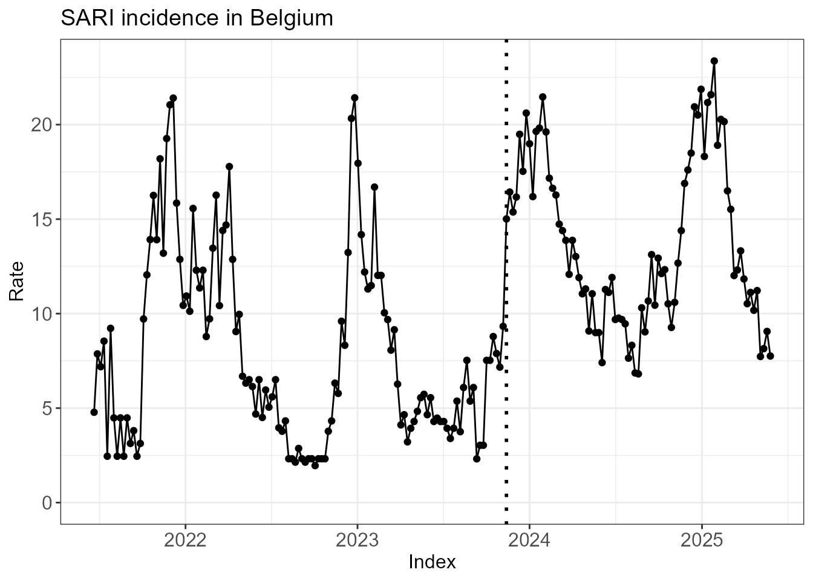

## Fit hidden Markov model

*Reading tip: it is not an easy task understand (or explain, for that
matter) what a hidden Markov model is. Instead of opting for a rigorous
exposition, below we gently talk through the relevant output of the
functions
[`run_hmm()`](https://sciensanogit.github.io/epiquest/reference/run_hmm.md)
and
[`create_hmm_plots()`](https://sciensanogit.github.io/epiquest/reference/create_hmm_plots.md)
in the hope that you will undestand what a HMM is by the end of this
section.*

The first step is to fit a hidden Markov model (HMM) to the surveillance
time series. If we set `n_states = 3`, we assume that the
epidemiological situation each week is in 1 of 3 (hidden) states. The
argument `type = rate` indicates that our data are incidences/counts,
rather than percentages (`type = perc`).

``` r

fit <- run_hmm(df_sari_be, n_states = 3, type = "rate")
```

Before diving into the technical mechanics of the HMM, we jump ahead to
the end to provide some intuition for where we are headed. The plot
below shows the time series with each week colored by its most probable
state. You may note that different states have different incidences. You
may also note that state changes from week to week are relatively rare.
In other words, the HMM identifies the hidden states by effectively
clustering the data across both the time dimension and incidence
dimension. By categorizing the data this way, we can use one (or more)
of these hidden states as our data-driven definition of the epidemic
window.

``` r

hmm_plots <- create_hmm_plots(fit)
hmm_plots$time_series_full
```


We dive into more details below. The
[`summary()`](https://rdrr.io/r/base/summary.html) function already
provides an overview of the most important information of the HMM fit.

``` r

summary(fit)
#> 
#> ========================================================
#>          EpiQUEST hidden Markov model summary           
#> ========================================================
#> 
#> --- Model configuration --------------------------------
#> Type:                    Continuous (Gaussian) 
#> Number of states:        3 
#> Seasonal:                FALSE 
#> Number of observations:  206 
#> 
#> --- Estimated state parameters -------------------------
#>  State   Mean Standard deviation
#>     L1  4.468              1.722
#>     L2 10.758              2.159
#>     L3 18.011              2.641
#> 
#> --- Transition matrix ----------------------------------
#>   State   ToL1   ToL2   ToL3
#>  FromL1 95.73%  4.27%  0.00%
#>  FromL2  2.51% 91.01%  6.48%
#>  FromL3  0.00% 11.32% 88.68%
#> 
#> --- State distribution (observations) ------------------
#>  State Total weight Proportion
#>     L1         72.6      35.2%
#>     L2         85.2      41.4%
#>     L3         48.2      23.4%
#> 
#> Note: Weights are posterior probabilities.
#> ========================================================
```

Each state has its own distribution of incidences. The function
[`run_hmm()`](https://sciensanogit.github.io/epiquest/reference/run_hmm.md)
assumes that each of these distributions is normal/Gaussian if
`type = rate`. Below you can see the estimated mean and standard
deviation of the 3 hidden states named `L1`, `L2` and `L3`. The states
are always ordered by increasing mean:

- `L1` is a **low activity state** with mean incidence 4.47.
- `L2` is a **medium activity state** with mean incidence 10.76.
- `L3` is a **high activity state** with mean incidence 18.01.

``` r

fit$states
#> # A tibble: 3 × 3
#>   state mean_state sd_state
#>   <chr>      <dbl>    <dbl>
#> 1 L1          4.47     1.72
#> 2 L2         10.8      2.16
#> 3 L3         18.0      2.64
```

The incidences form one important aspect of the hidden Markov model
called **emission**. The underlying idea is that different states *emit*
different kinds of incidences. Part of the variation in incidence
throughout the year (from baseline incidences during low activity weeks
to peak incidences during high activity weeks) is explained by the
difference in hidden state.

A second important aspect is **transition**: starting with an initial
state for the first week, the HMM models the transition of states from
one week to the next. Check on the diagonal of the transition matrix
below that, for all 3 states, the probability of staying in that state
is around 90% or higher. In addition, we see that transitions directly
between the low activity state `L1` and the high activity state `L3` are
very unlikely. Instead, such transition occur indirectly through the
medium activity state `L2`.

``` r

round(fit$transition, 2)
#>        ToL1 ToL2 ToL3
#> FromL1 0.96 0.04 0.00
#> FromL2 0.03 0.91 0.06
#> FromL3 0.00 0.11 0.89
```

As a byproduct of estimating the emission distributions and transition
probabilities, the HMM provides information about the hidden state each
week. There is of course uncertainty about these states, so the model
provides a probability distribution[^1] (so-called *posterior
probabilities*) across states rather than a single ‘hard’
classification. The time series plot below visualizes these results,
with each observation colored according to its most probable state.

``` r

hmm_plots$time_series_full
```

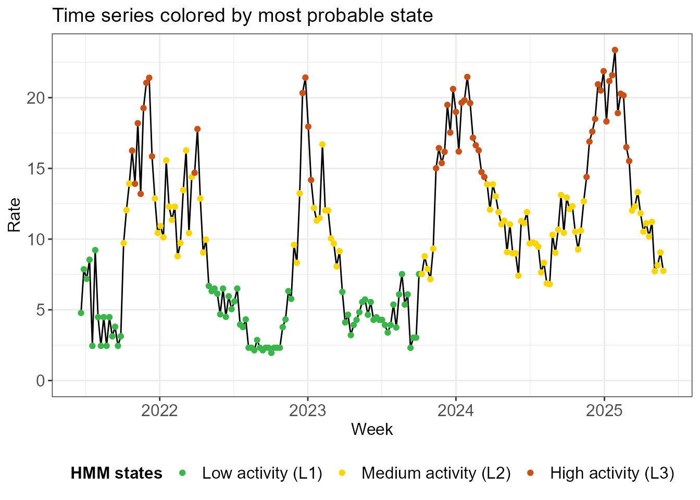

The next plots illustrate the uncertainty in the model about the state
assignments. In the first one, state probabilities are plotted for each
week. Note that there are blocks of time where there is no (or very
little) uncertainty about the state assignment. On the other hand, we
observe that uncertainty occurs when transitioning from one state to the
next.

``` r

hmm_plots$prob_states
```

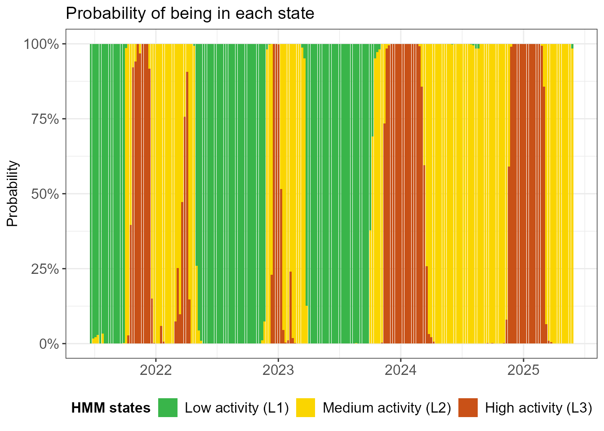

The facet plot below shows the time series 3 times, once for each state.
The observations are shaded by the probability that they are in the
state in question. An observation can appear twice in the plot: if it
has 90% probability to be in `L2` (medium activity/yellow) and 10%
probability to be in `L3` (high activity/red), then it will appear
almost fully in yellow in the middle facet and very faintly in red in
the top facet. Note that there are quite some shaded observations in the
high activity `L3` state.

``` r

hmm_plots$time_series_per_state
```

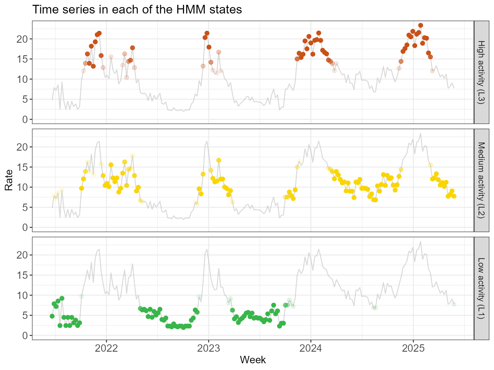

Finally, below we see a histogram of the observed incidences in each
state, overlayed with the fitted normal distributions. Actually, the
histogram has been weighted by the posterior probabilities - much like
in the previous visualization - so an observation can contribute
partially to more than one state.

``` r

hmm_plots$histogram_soft
```

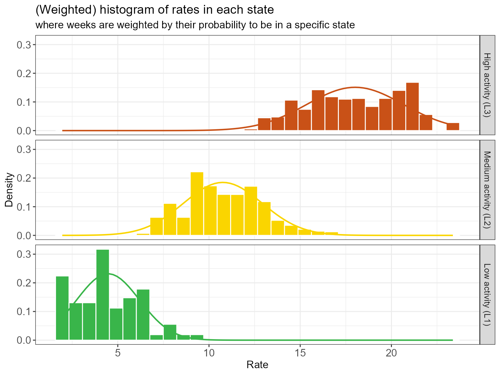

We see some overlap in the emission distribution in each state. Why were
they not separated more by the HMM? For example, would it not make more
sense to reassign some of the highest incidences observed in the `L2`
state (yellow) to the `L3` state (red)? While this may seem better from
an incidence perspective, reassigning those weeks to a different state
would introduce more state switching. In balancing **clustering in
incidences** and **clustering in time**, the model allows some overlap
in indicence distributions if it avoids excessing state switching and
favors extended periods of stable state assignments.

Some last remarks concerning missing data: - The function
[`run_hmm()`](https://sciensanogit.github.io/epiquest/reference/run_hmm.md)
can handle missing observations; they **should not** be removed from the
data, but rather be left as `NA`. - However, if the surveillance signal
is interrupted for extended periods (e.g., for systems that do not
operate during low intensity months), it is strongly recommended to use
`seasonal = TRUE` in
[`run_hmm()`](https://sciensanogit.github.io/epiquest/reference/run_hmm.md).
In that case, the weeks in which no data were collected **should** be
removed. A grouping variable `season` must be included to indicate which
weeks belong to the same season. The HMM will then treat each seasonal
subseries as an independent time series.

## Select epidemic state(s)

It is essential for an expert familiar with the surveillance system to
review the model output and verify whether one (or more) of these states
truly align with a high burden or the operational definition of an
epidemic. This expert validation ensures that the statistical
transitions identified by the model reflect the practical realities and
pressures faced by the healthcare system, which the HMM of course cannot
take into account.

**In practice, a model with `n_states = 2` and `n_states = 3` should be
fitted and compared. The hidden state with the highest mean incidence is
the most likely candidate for the epidemic state.** We can foresee some
exceptions, however: - If the data exhibit very high peaks, the model
may split (what an expert think of as) the epidemic period into two
separate states, showing a difference between a high burden and an
extremely high one. In these cases, both of those states together might
be used to define the full epidemic. - In the same vein, if the data
exhibit a single very high (*super-epidemic*) peak, with smaller peaks
in the other seasons, then one of the states may capture the extreme
incidence in the super-epidemic peak. If the circumstances surrounding
this peak are thought unlikely to occur again, the super-epidemic state
can be excluded from the definition of a normal epidemic.

## Compute QUEST thresholds

Once an epidemic state is identified, QUEST thresholds can be computed
using
[`run_threshold_computation()`](https://sciensanogit.github.io/epiquest/reference/run_threshold_computation.md).
The default option is that the state with the highest mean incidence is
the epidemic state. The default can be overwritten using the
`epidemic_state_incidences` argument (not illustrated here).

The threshold computation is straightforward: the low, medium, high and
very high thresholds are the 5%, 70%, 90% and 99% quantile,
respectively, of the distribution of the observed incidences, weighted
by the posterior probability of being in the epidemic state. This is
exactly the distribution visualized above (`hmm_plots$histogram_soft`).

Said another way:

- We simply want to define thresholds as quantiles of the observed
  incidences in the epidemic state.
- Since the HMM does not definitively determine which weeks are in which
  state, but rather uses a soft probabilistic approach, we allow for
  incidences to only partially contribute to the distribution of the
  observed incidences in the epidemic state by using posterior
  probabilities as weights.

``` r

thresh <- run_threshold_computation(fit)
```

``` r

summary(thresh)
#> 
#> ==============================================================
#>         EpiQUEST threshold summary                            
#> ==============================================================
#> 
#> --- Model configuration --------------------------------------
#> Type:                          Continuous (Gaussian) 
#> Number of states:              3 
#> Seasonal:                      FALSE 
#> Number of observations:        206 
#> State(s) defined as epidemic:  L3 
#> 
#> --- Calculated QUEST thresholds ------------------------------
#>      Level Quantile  Value
#>        Low       5% 13.881
#>     Medium      70% 19.734
#>       High      90% 21.408
#>  Very high      99% 22.647
#> 
#> Note: Thresholds calculated using weighted ECDF
#> based on posterior probabilities of epidemic state(s).
#> ==============================================================
```

The function
[`create_threshold_plots()`](https://sciensanogit.github.io/epiquest/reference/create_threshold_plots.md)
recreates the plots we previously discussed, but with the computed
thresholds added. Below we see that the low threshold reasonably
separates the medium activity (`L2`) and high activity (`L3`) states,
except for some outliers of the `L2` state.

``` r

thresh_plots <- create_threshold_plots(thresh)
thresh_plots$histogram_soft
```

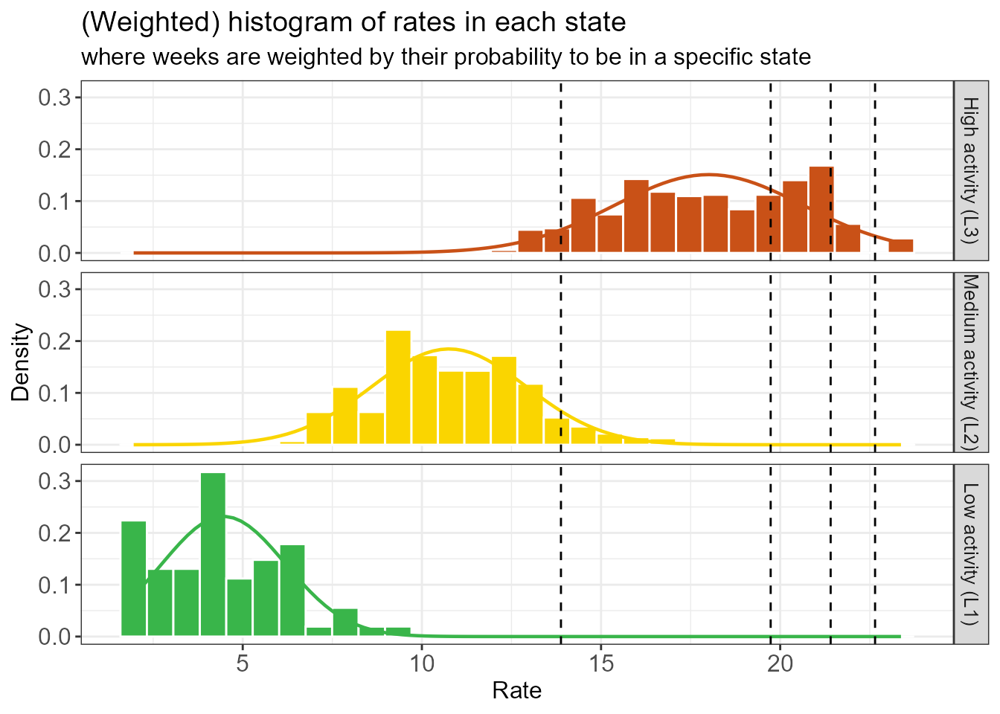

There are none of these `L2` outliers in the last 2 seasons, as we can
see below.

``` r

thresh_plots$time_series_full
```

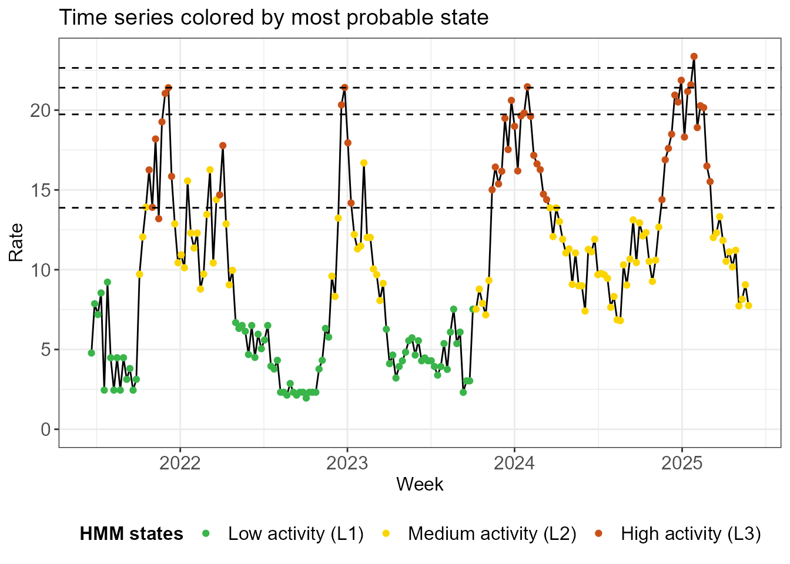

**The QUEST thresholds are straightforward to interpret.** Take the
medium threshold as an example, which is computed as the 70% quantile of
the observed epidemic state incidences. - Surpassing the medium
threshold in the current week means that *the incidence is in the top
30% of epidemic incidences in the historic data*. - This statement begs
the question what an epidemic incidence is: *the definition of the
epidemic is data-driven, the output of a statistical procedure that
clusters in time and incidence such that epidemic weeks are part of a
sustained period in which incidence is high.*

The definition of epidemic incidence has a much bigger impact on the low
threshold than on the other ones. The very high threshold will be
heavily influenced by the highest observation, on the other hand.

## Check stability

Would the thresholds meaningfully change if we had one fewer week of
data? We check how stable the thresholds and the HMM states are by
running the model on an increasingly large window of the data. We start
with an initial window of 50 weeks and gradually at additional data one
week at a time. The procedure may run for a while because…

Would the thresholds change meaningfully if the dataset were slightly
different - for example, if we had one fewer week of data? We evaluate
threshold and HMM stability by recomputing thresholds on an expanding
window of data, starting with an initial 50-week period and adding data
one week at a time.

``` r

fit_loop <- run_loop_thresholds(df_sari_be, n_states = 3)
```

The plot below shows the evolution of the parameters of the incidence
distribution (the mean and standard deviation for a normal distribution)
in each state as the data window expands. We see a clear break:
initially the HMM has some difficulty identifying the states,
significantly changing the mean and standard deviation of the states
when one week of data is added. Eventually the state assignments
stabilize, changing more smoothly when new data is added.

``` r

loop_plots <- create_loop_plots(fit_loop)
loop_plots$states_facet
```

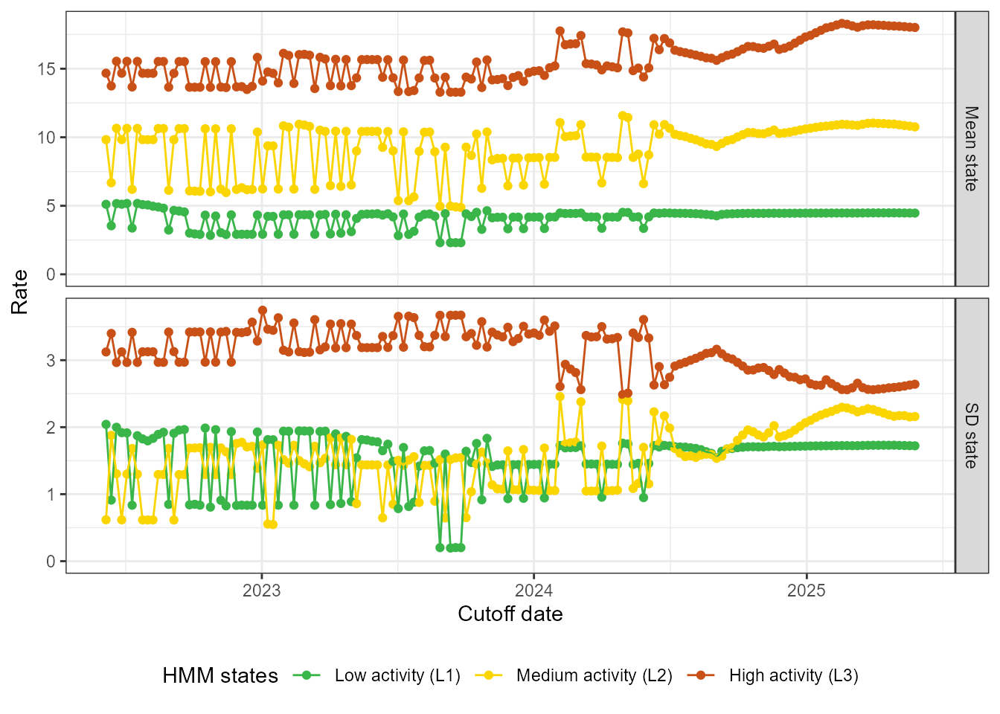

It may be easier to check the stability of the mean and standard
deviation jointly. Below we plot the mean of every state, together with
a dark shaded band at one standard deviation of the mean and a light
shaded band at two standard deviations of the mean.

``` r

loop_plots$states
```

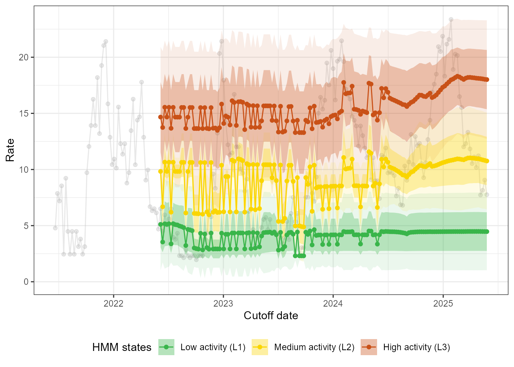

Finally, we can check the stability of the thresholds itself. We draw
the same conclusions, most notably that the thresholds react relatively
smoothly to the addition of new data in the last couple of months in the
data.

``` r

loop_plots$thresholds
```

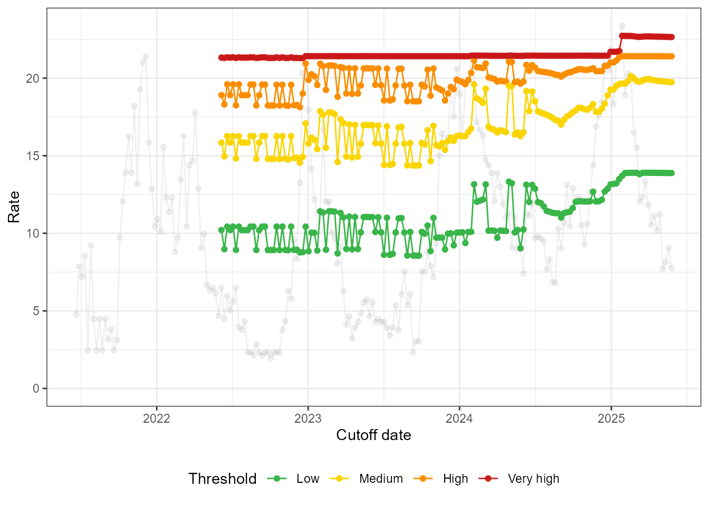

The [`summary()`](https://rdrr.io/r/base/summary.html) function provides
information about the thresholds and the mean of the HMM states over the
past 12 iterations. If the states and thresholds are unstable, consider
changing the number of states. If they are slightly unstable (i.e., if
the fluctuations are reasonably small), you can consider taking the
median of the computed thresholds over the last 12 iterations of the
stability analysis.

``` r

summary(fit_loop)
#> 
#> ========================================================
#>         EpiQUEST stability analysis summary             
#> ========================================================
#> 
#> --- Loop configuration ---------------------------------
#> Number of iterations (refits):  156 
#> Step size (increments):         7 units
#> Summary window:                 12 last iterations
#> 
#> --- Threshold stability (in summary window) ------------
#>       type   Median     Mean      Min      Max
#>        Low 13.89241 13.88527 13.81050 13.89924
#>     Medium 19.81590 19.82544 19.73403 19.93247
#>       High 21.41031 21.41018 21.40796 21.41212
#>  Very high 22.67035 22.66909 22.64746 22.68797
#> 
#> --- State mean stability (in summary window) -----------
#>  state  Median      Mean    Min    Max
#>     L1  4.4785  4.476667  4.468  4.482
#>     L2 10.9540 10.928250 10.758 11.034
#>     L3 18.1250 18.115000 18.011 18.208
#> 
#> For information on standard deviation stability and
#> overlap, please look at output of create_loop_plots().
#> ========================================================
```

## Change perspective?

Recall from the data preparation step that changes were made to the
surveillance system in November 2023. You may have noticed that the low
activity `L1` state is mainly used for the low season between peaks
before the change.

``` r

hmm_plots$time_series_full +
  geom_vline(xintercept = as.Date("2023-11-13"), linetype = "dotted", linewidth = 1)
```

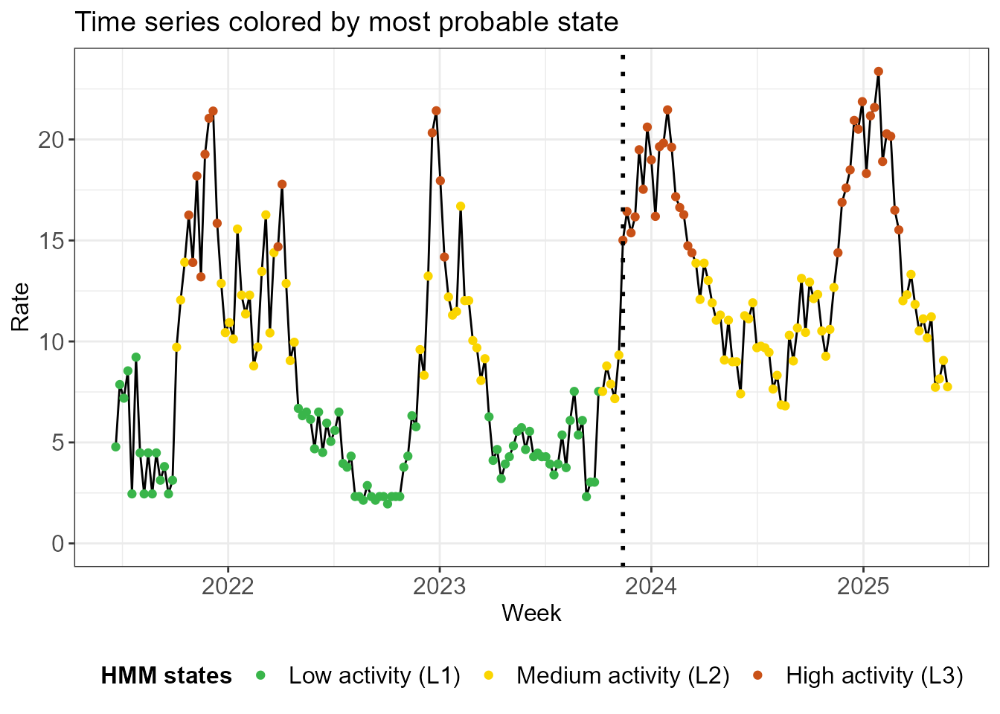

What would happen if we just used the data from after the change in a
model with 2 states? We investigate below. Note that the means of the
new `L1` and `L2` states are similar to the means of the old `L2` and
`L3` states.

``` r

df_sari_be_new <- df_sari_be %>% 
  filter(index >= as.Date("2023-11-13"))
fit_new <- run_hmm(df_sari_be_new, n_states = 2)
summary(fit_new)
#> 
#> ========================================================
#>          EpiQUEST hidden Markov model summary           
#> ========================================================
#> 
#> --- Model configuration --------------------------------
#> Type:                    Continuous (Gaussian) 
#> Number of states:        2 
#> Seasonal:                FALSE 
#> Number of observations:  81 
#> 
#> --- Estimated state parameters -------------------------
#>  State   Mean Standard deviation
#>     L1 10.582              1.922
#>     L2 18.359              2.395
#> 
#> --- Transition matrix ----------------------------------
#>   State   ToL1   ToL2
#>  FromL1 97.85%  2.15%
#>  FromL2  6.01% 93.99%
#> 
#> --- State distribution (observations) ------------------
#>  State Total weight Proportion
#>     L1         47.7      58.8%
#>     L2         33.3      41.2%
#> 
#> Note: Weights are posterior probabilities.
#> ========================================================
```

In terms of most probable states, the classification is identical to the
old one.

``` r

hmm_plots_new <- create_hmm_plots(fit_new)
hmm_plots_new$time_series_full
```

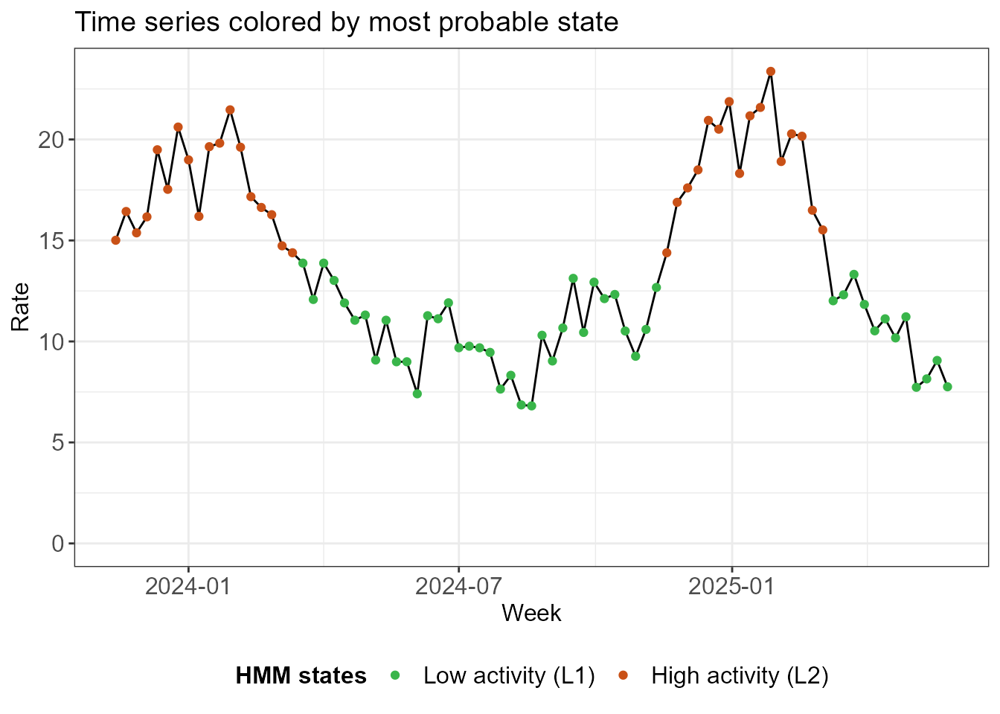

The thresholds are comparable between the methods, with the biggest
impact on the low threshold.

``` r

thresh_new <- run_threshold_computation(fit_new)
tibble(
  Threshold = c("Low", "Medium", "High", "Very high"),
  Old = thresh$threshold,
  New = thresh_new$thresholds
)
#> # A tibble: 4 × 3
#>   Threshold   Old   New
#>   <chr>     <dbl> <dbl>
#> 1 Low        13.9  14.4
#> 2 Medium     19.7  19.8
#> 3 High       21.4  21.4
#> 4 Very high  22.6  22.9
```

The 2-state model on the recent data is much more stable, as we see
below.

``` r

fit_loop_new <- run_loop_thresholds(df_sari_be_new, n_states = 2)
```

``` r

loop_plots_new <- create_loop_plots(fit_loop_new)
loop_plots_new$thresholds
```

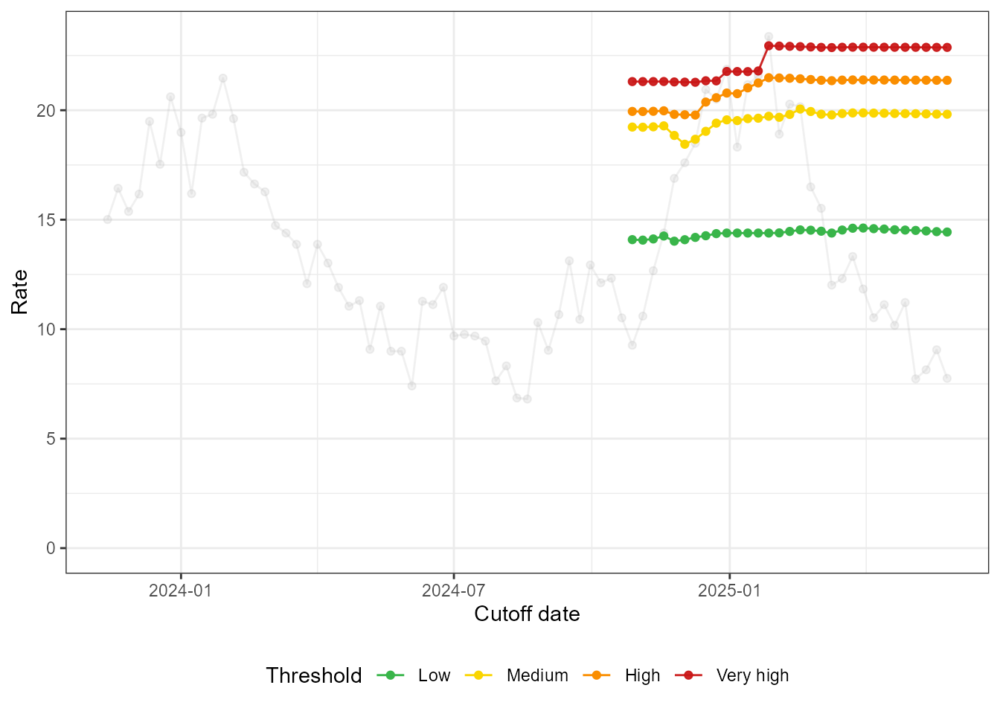

``` r

loop_plots_new$states_facet
```

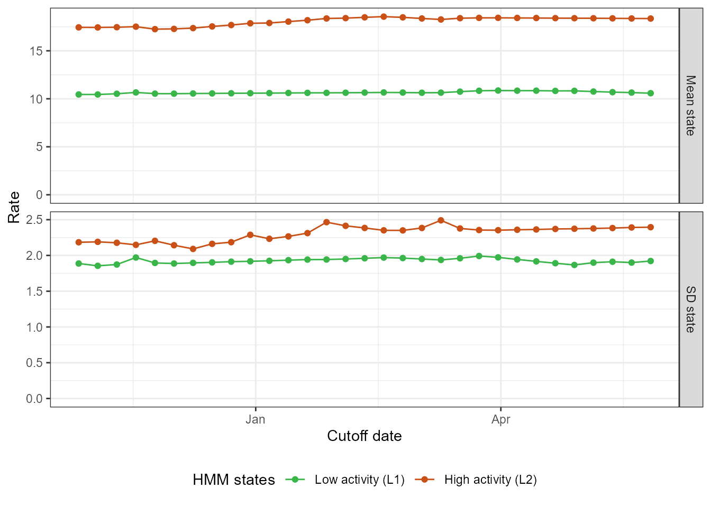

The exercise we did here shows that the QUEST thresholds, despite their
data-driven definition of the epidemic, can produce stable results, even
with only two (incomplete) seasons of data.

[^1]: After fitting the HMM, there are 2 main ways to extract
    information about the hidden state for each week. A global approach
    is to find the most likely sequence of hidden states. A second
    approach is to, for each week individually, extract a probability
    distribution of hidden states (so-called *posterior probabilities*).
    We make use of the latter approach.
